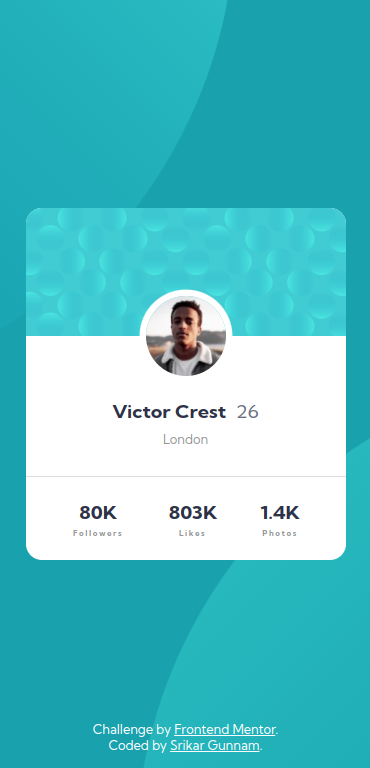
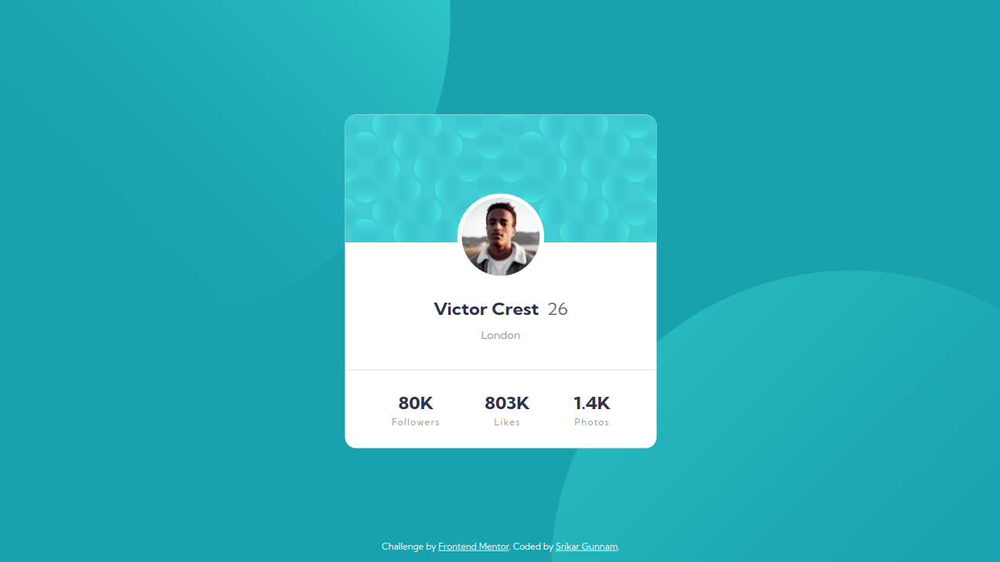

# Frontend Mentor - Profile card component solution

This is a solution to the [Profile card component challenge on Frontend Mentor](https://www.frontendmentor.io/challenges/profile-card-component-cfArpWshJ). Frontend Mentor challenges help you improve your coding skills by building realistic projects. 

## Table of contents 📜

- [Frontend Mentor - Profile card component solution](#frontend-mentor---profile-card-component-solution)
  - [Table of contents 📜](#table-of-contents-)
  - [Overview](#overview)
    - [The challenge](#the-challenge)
    - [Screenshots](#screenshots)
      - [Mobile preview](#mobile-preview)
      - [Desktop preview](#desktop-preview)
    - [Links 🔗](#links-)
    - [Built with 🏗](#built-with-)
  - [Author 👦](#author-)
    - [Srikar Gunnam](#srikar-gunnam)

## Overview

### The challenge

- Build out the project to the designs provided

### Screenshots

#### Mobile preview

#### Desktop preview

### Links 🔗

- [My Solution](https://github.com/srikargunnam/frontendmentor-profile-card-component)
- [Live Site](https://srikargunnam.github.io/frontendmentor-profile-card-component/)

### Built with 🏗

- Semantic HTML5 markup
- CSS3
- Flexbox
- Mobile-first workflow
- [Sass preprocessor ](https://sass-lang.com/) - For styles

## Author 👦

### Srikar Gunnam

- Website - [srikargunnam.com](https://srikargunnam.com) 	🕸
- Frontend Mentor - [@srikargunnam](https://www.frontendmentor.io/profile/srikargunnam)
- Twitter - [@SrikarGunnam](https://twitter.com/SrikarGunnam)
- Codepen - [@srikargunnam](https://codepen.io/srikargunnam)
- GitHub - [@srikargunnam](https://github.com/srikargunnam/)